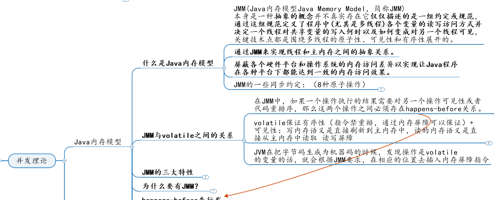
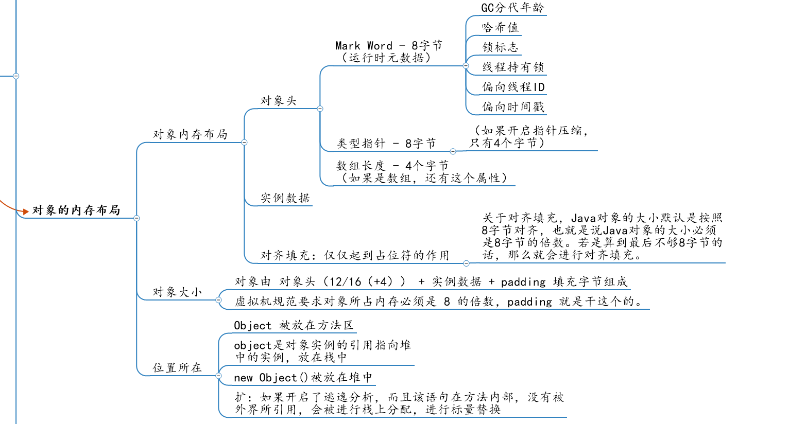

# Java面试题-思维导图版

现在上传到了百度脑图上了，不用下载就可以复习了。

| 名称             | 脑图链接                                                     |
| ---------------- | ------------------------------------------------------------ |
| MySQL篇          | http://naotu.baidu.com/file/172ce6a9e4ab84059fb390ccc763f358?token=a2e38b6c8e7843b8 |
| Redis篇          | http://naotu.baidu.com/file/8f8a16007d5e197b06385b0bc2f15124?token=1c1c4aa9fe79a864 |
| JVM篇            | http://naotu.baidu.com/file/104b0c7d3a4b2401f4b19c0986ef5b52?token=1d840b4df2bb3daa |
| Java集合篇       | http://naotu.baidu.com/file/7919c06a0f4551e978321221c86cc1bb?token=85f379fa36c17c71 |
| Java基础篇       | http://naotu.baidu.com/file/03f1bd351c757ec8ee5cb87d1064429a?token=d7d3d050d6f579bd |
| Java Web篇       | http://naotu.baidu.com/file/da8300aebb307b9aac17bd120b5df2c8?token=130b25e3502d627e |
| Java 微服务篇    | http://naotu.baidu.com/file/ce86db2242f646349e72271aad5f429a?token=9533bd95d7d978d9 |
| Java SE篇        | http://naotu.baidu.com/file/89fdf908fafeb461eea000b419495737?token=11ada6bed72569ec |
| 注射与反解篇     | http://naotu.baidu.com/file/c7bad9b4a2a9f2f2de8573fe5bc8d580?token=b4543e68cc580e46 |
| 消息中间件篇     | http://naotu.baidu.com/file/bb2a0809fc7ee12fe0ce6cb45eaf128f?token=d9c66c6621574fc0 |
| 设计模式篇       | http://naotu.baidu.com/file/67a3b83a257d15fc966b95f741e7d3e1?token=2b7069793ef55217 |
| 计算机基础篇     | http://naotu.baidu.com/file/4f73e0af8aec4c08716bc96b8bd653bc?token=c361adef1dc50c44 |
| 多线程+JUC并发篇 | http://naotu.baidu.com/file/29b5e346543156138c94c2920bf4b9c4?token=cea6d42bd1bac509 |

将Java面试题整理成了思维导图版，有需要的就自己拿去，目前自用。

* JUC

* JVM

